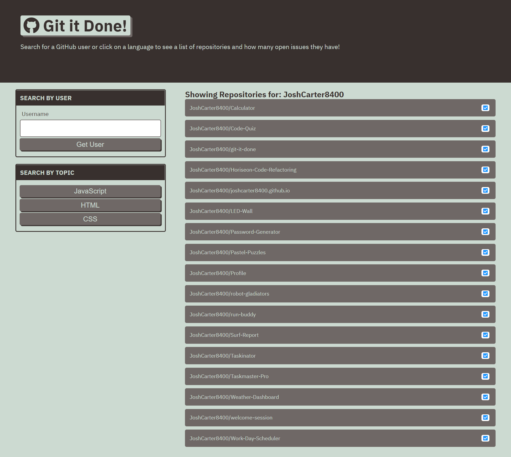

# Git-It-Done
With this application users are able to look up a username on github and see thier repos by name and if that repo has any issues or not. They are able to click on each repo and be taken to it view the code and work. They can also search be language of JavaScript, HTML, and CSS.

## Languages and Tools Used
1. HTML5
2. CSS3
3. JavaScript
4. Server Side APIs
5. AJAX and JSON

### Application can be deployed here: https://joshcarter8400.github.io/git-it-done/

